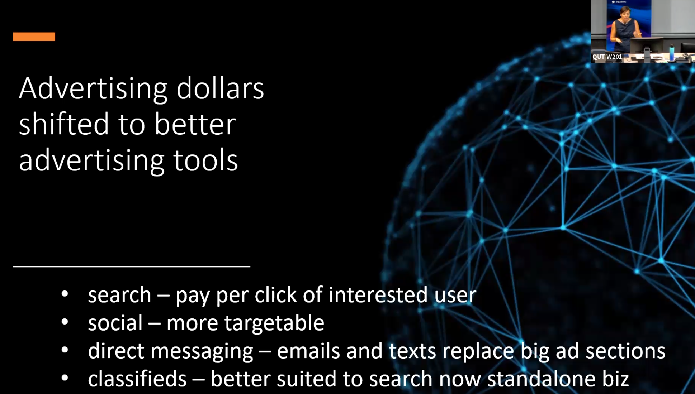
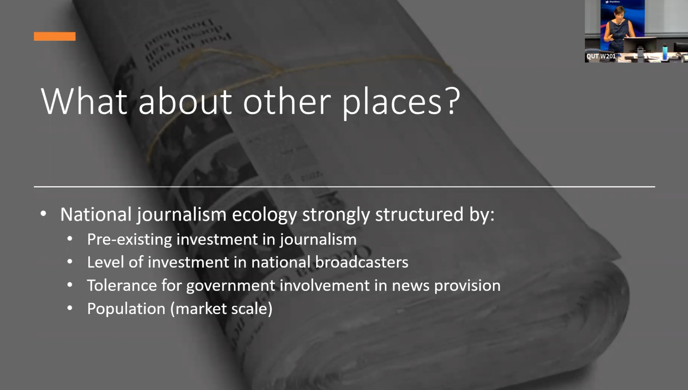

# Feb 2021 - Prof Amanda Lotz

[https://research.qut.edu.au/dmrc/people/amanda-lotz/](https://research.qut.edu.au/dmrc/people/amanda-lotz/)

Vid [https://qut.zoom.us/rec/share/z4xhrdA8N4TqhnHaBIp9tIqz-T4s9ftxik3jFHA2LE9ccj7dtnN5-lItM\_p07pHb.gf48JPecKwNCpyss](https://qut.zoom.us/rec/share/z4xhrdA8N4TqhnHaBIp9tIqz-T4s9ftxik3jFHA2LE9ccj7dtnN5-lItM_p07pHb.gf48JPecKwNCpyss) Passcode: m!7f6Xia

tweets 

TJ pics

**"Information may want to be free, but journalism can't be: An industrial analysis of newspaper disruption"**

* Book out later this year - Media Disrupted: surving pirates, cannibals and streaming wars
* the way internet communications tech disrupted music, television, film
* studying internet disruption of TV since early 2000s
* by looking at one sector, maybe that might help us have more sophisticated conversations about how net tech disrupted more sectors
* I rely on macro level data
* Graph in Conversation piece - ad spend on platforms  
* 2nd graph - what has happened in terms of sales - shows strong decline from 1977 ie, before digital emergence 
* phenomenon with much longer history than the digital era
* Reuters study graphs - time spent with news was 16 mins per week
* I'm going to talk about journalism in a way that journalist don't usually talk about journalism - that is, that it's a business
*  Other industries have responded well
* **perhaps the focus has been on the wrong thing** - breaking down to profit and revenue, it's about trying to shift the focus a little bit
* maybe if we can look at the situation from another angle, we can start looking at actual solutions
* an industrial analysis starts with this statement: the business of newspapers is attracting, then selling attention - that's how it worked. That doesn't diminish its societal functions
* we have to understand where the money came from to make that all possible
* the bundled newspaper was the result of the technological conditions of the pre-internet age
* to get the economics of it to work, you had to attract a big, heterogenous audience
* it was designed that way to deliver value to the that big heterogeneous audience
* a difference between news and journalism - news, a thin account of events; journalism, contextualized reporting of the news
* sometimes journalism finds things, and then they become news
* bundled newspaper had loads of other things - obits, crosswords, comics, movie listings etc - and it had ads
* ads were revenue stream for newspapers - were 80% in US, 70% in Aus
* they added to value of readers' experience ie, before internet shopping
* **internet communications tech unbundled the newspaper**
* behaviour of reading a newspaper, you see the headlines, you see the ads, you move across and up and down, looking and thinking
* this doesn't happen online. People aren't going to news websites and scanning around etc, we just look and read the thing we want
* that matters to advertisers because that diminishes the value of the space there
* information can be commercialized - weather \(bom\), on demand - a very specific advertising location
* "ubiquity of news on social media and websites diminished its commodity value"
* **key slide** - **advertising $ have shifted to better tools**. A tech like "search" means businesses can place ads infront of people who are searching for a product, ie school shoes
* in contrast, a display ad in a paper - who is going to see that?

* **None of this has anything to do with news or journalism**
* newspapers are no longer the best way to attract attention
* the value of the bundle has eroded; advertisers are using better tools
* newspapers have lost the ad revenue that supported the news and journalism
* in the background, **there's a couple of other factors** - the corporatisation of newspapers & cross media competition
* corporatisation - leads news orgs to enter digital age in weakened state. Publicly traded stocks, began late 60s, full force by 80s
* at that point, newspapers became beholden to profit and loss reporting
* corporatisation was the kindling before the spark of digitisation
* cross media comp - it meant that all news orgs could do all things - they all make videos, they all make audio, etc
* Big international players can circulate more widely, beyond their original region
* Implications: only enough scale for few. There's a few players that are competing for what's left of the attention dollars.
* And subscriber money is limited, and it goes to those who have distinct value proposition
* In a country of only 25 million, how many players can a subscriber model support?
* if you're "somewhat" interested in news, are you likely to pay for a subscription?
* what about local? for the most part, the internet has not really replaced this. there's a market for readers and advertisers
* However, local doesn't scale. So that makes it look less like a good investment

* what are the solutions?
* the core problem is funding - **but we need to understand that ad money is the past**
* subscription and public funding at scale are most viable solutions
* "we still need the roads. we're going to have to figure out how to pay for them."
* a democratic society cannot function without news and journalism
* the "value" of journalism cannot be exposed by graphs or data trying to consider what is lost if it's not there 

